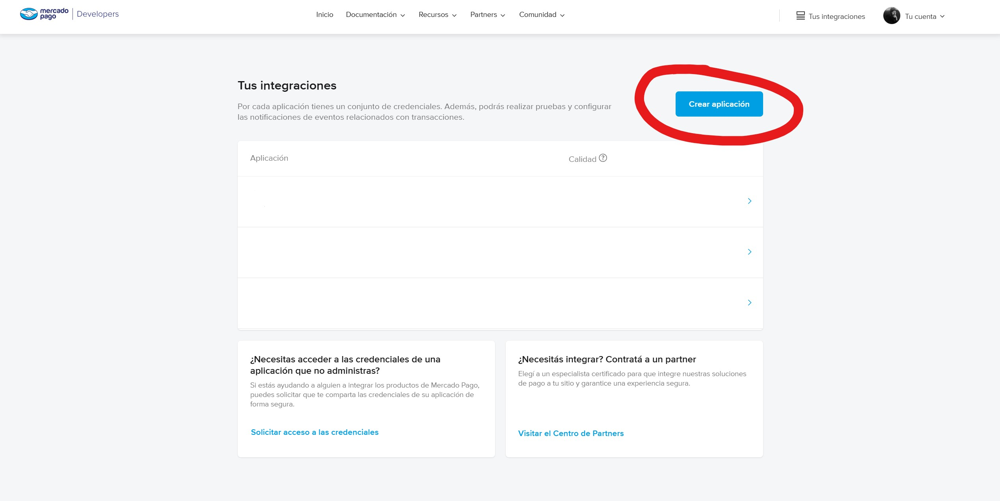
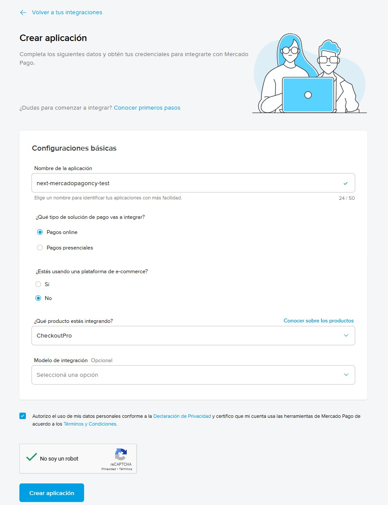
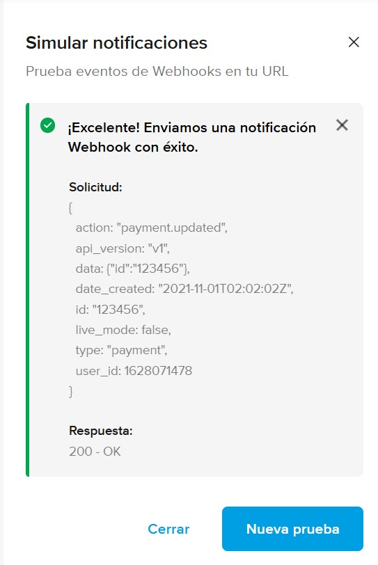

# Integración de Mercado Pago Checkout Pro en Next.js

En este respositorio vamos a aprender a integrar Mercado Pago Checkout Pro en una aplicación de comentarios utilizando Next.js con App Router. El fin de la aplicación es poder agregar mensajes a una lista de mensajes, por la cual debemos pagar para que se pueda agregar.

> [!IMPORTANT]
> Por simplicidad, nuestra aplicación no guarda los mensajes en una base de datos, sino que los guarda en un archivo llamado `data.db` en la raíz del proyecto. Escribir al file system no está permitido en muchos proveedores de hosting, por ende, en un ambiente de producción deberíamos usar una base de datos.

## Requisitos

Además de tener lo necesario para correr una aplicación Next.js, necesitamos:

- Una cuenta de Mercado Pago para crear nuestra aplicación
- Poder exponer un puerto de nuestra máquina a internet para poder recibir notificaciones de Mercado Pago
  - Si usas VSCode o algún editor basado en el, podes usar los [Dev Tunnels](https://code.visualstudio.com/docs/editor/port-forwarding). También es posible [instalarlo sin VSCode](https://learn.microsoft.com/es-es/azure/developer/dev-tunnels/get-started?tabs=windows)
  - También podemos usar [Cloudflared Tunnel](https://developers.cloudflare.com/cloudflare-one/connections/connect-networks/get-started/create-local-tunnel/#1-download-and-install-cloudflared)

## Video

[](https://www.youtube.com/watch?v=BUHUW7tAr_Y)

## Indice

1. [Crear una integración en Mercado Pago](#crear-una-integración-en-mercado-pago)
    1. [Crear las cuentas de prueba de vendedor y comprador](#crear-las-cuentas-de-prueba-de-vendedor-y-comprador)
    2. [Crear una integración con la cuenta de prueba vendedor](#crear-una-integración-con-la-cuenta-de-prueba-vendedor)
2. [Implementar pagos en nuestra aplicación](#implementar-pagos-en-nuestra-aplicación)
    1. [Crear una preferencia de pago](#crear-una-preferencia-de-pago)
    2. [Realizar un pago de prueba](#realizar-un-pago-de-prueba)
3. [Recibir notificaciones de pagos](#recibir-notificaciones-de-pagos)
    1. [Configurar un webhook de pagos](#configurar-un-webhook-de-pagos)
    2. [Verificar la autenticidad del pago](#verificar-la-autenticidad-del-pago)

> [!IMPORTANT]
> El código del proyecto ya está implementado, usá este README para guiarte en la implementación o para entender cómo funciona cada parte y agregarlo a otro proyecto.

## Crear una integración en Mercado Pago

Esta es posiblemente la parte más complicada dado lo confuso que puede ser el flujo de crear y probar nuestra aplicación. Para integrar pagos con Mercado Pago en nuestra aplicación, necesitamos crear una integración. Para eso, vamos a ir a [Mercado Pago Developers](https://www.mercadopago.com.ar/developers/panel/app) y creamos una nueva aplicación.



Una vez dentro, cargamos todos los datos de nuestra aplicación asegurandonos de seleccionar `CheckoutPro` en "¿Qué producto estás integrando?" ya que es el método de pago que vamos a utilizar.

Una vez creada la aplicación vamos a ser redirigidos a la pantalla de integración. Como todavía no queremos procesar pagos reales, vamos a dirigirnos a la sección `Credenciales de prueba` que tenemos a la izquierda. Pero, cuando intentamos entrar nos encontramos con esto:


Resulta que no hay credenciales de prueba para `CheckoutPro`, pero, tenemos usuarios de prueba. Dado que en Mercado Pago, no podemos crear una aplicación de la que seamos beneficiarios (recibamos pagos) y pagarnos a nosotros mismos, lo que vamos a tener que hacer es crear dos cuentas de prueba (una para el vendedor o beneficiario y otra para el comprador).

### Crear las cuentas de prueba de vendedor y comprador

Vamos a ir `Cuentas de prueba` en el menú izquierdo y creamos dos cuentas nombradas algo así como `Comprador` y `Vendedor`. A cada una le asignamos el país donde queremos operar y un dinero inicial.


> [!WARNING]
> Las cuentas de prueba no se pueden borrar y son válidas para todas las aplicaciones.

### Crear una integración con la cuenta de prueba vendedor

Ya que nuestra cuenta original de Mercado Pago solo puede manejar pagos reales, vamos a tener que crear una nueva aplicación (como hicimos recientemente) logueandonos con la cuenta de prueba vendedor.

No te preocupes, la aplicación que creamos originalmente es la que vamos a usar para manejar los pagos reales una vez que terminemos de desarrollar y probar la aplicación.

Vamos a abrir la [página de desarrolladores de Mercado Pago](https://www.mercadopago.com.ar/developers/panel/app/) una ventana de incognito y loguearnos en la cuenta de prueba vendedor con el usuario y contraseña correspondientes y creamos una aplicación con los mismos datos (y otro nombre) que la aplicación original.



Después nos vamos a dirigir a `Credenciales de producción` (como es una cuenta de prueba, producción es prueba) y nos copiamos el `Access Token` y lo pegamos en nuestro archivo `.env.local` en `MP_ACCESS_TOKEN`.

Finalmente ya tenemos las credenciales para poder usar en nuestra aplicación, espero no haya sido mucho trabajo.

## Implementar pagos en nuestra aplicación

Nuestra aplicación ya tiene un `/src/app/page.tsx` que renderiza un formulario para agregar un mensaje a nuestra lista de mensajes. Al hacer submit ejecuta un server action que muestra en consola el mensaje que queremos agregar:

```tsx
async function add(formData: FormData) {
  "use server";

  const message = formData.get("text") as string;

  console.log(message)
}
```

### Crear una preferencia de pago

En `/src/api.ts` agregamos una función `submit` en `message` que se encargue de crear una preferencia de pago y devolver el init point (url de pago):

```ts
const api = {
  message: {
    async submit(text: string): Promise<string> {
      // Creamos la preferencia incluyendo el precio, titulo y metadata. La información de `items` es standard de Mercado Pago. La información que nosotros necesitamos para nuestra DB debería vivir en `metadata`.
      const preference = await new Preference(mercadopago).create({
        body: {
          items: [
            {
              id: "message",
              unit_price: 100,
              quantity: 1,
              title: "Mensaje de muro",
            },
          ],
          metadata: {
            text,
          },
        },
      });

      // Devolvemos el init point (url de pago) para que el usuario pueda pagar
      return preference.init_point!;
    }
  }
}
```

> [!NOTE]
> Podemos pensar a la preferencia de pago como un objeto que representa una orden de compra. algo que un usuario quiere comprar.

Ahora actualizamos la función `add` para que use la función `submit` de nuestro archivo `/src/api.ts` y envie al usuario a la url de pago:

```tsx
async function add(formData: FormData) {
  "use server";

  const message = formData.get("text") as string;
  const url = await api.message.submit(message);

  redirect(url);
}
```

### Realizar un pago de prueba

Ahora vamos a iniciar sesión con nuestra cuenta de prueba comprador y vamos a intentar pagar por la preferencia de pago que creamos anteriormente.


Bien, nuestro pago fue aprobado y ahora necesitamos que nuestra aplicación sepa de esta transacción para que podamos agregar el mensaje a nuestra lista.

## Recibir notificaciones de pagos

En Mercado Pago no todos los medios de pago son "síncronos", por ende, es necesario configurar una URL de nuestra aplicación a la cual Mercado Pago nos notifique cuando un pago haya sido realizado / rechazado / anulado / etc.

Como Mercado Pago no sabe que es `localhost:3000` (ni tampoco lo que es nuestro equipo local), vamos a tener que exponer el puerto donde corre nuestra aplicación en nuestro equipo local a internet. Yo estoy usando VSCode, por ende voy a usar `Dev Tunnels` para exponer el puerto. Si nos dirigimos a la sección de `Ports` y hacemos click en `Forward a Port`, podemos elegir un puerto (nuestra aplicación corre en el 3000) y nos dará una URL a la cual apuntar nuestro webhook. Asegurate de cambiar la visibilidad de la URL a `Public` para que Mercado Pago pueda acceder a ella.


Si corremos nuestra aplicación con `npm run dev` (habiendo hecho `npm install` previamente) y luego entramos a la URL que nos da el `Dev Tunnel`, deberíamos ver nuestra aplicación corriendo.

Ahora vamos a crear una ruta en nuestra aplicación que se encargue de recibir las notificaciones de Mercado Pago. Para eso creamos el archivo `src/app/api/mercadopago/pagos/route.ts` y agregamos el siguiente contenido:

```ts
export async function POST(req: Request) {
  // Obtenemos el cuerpo de la petición que incluye información sobre la notificación
  const body = await req.json();

  // Vemos su contenido
  console.log(body);

  // Respondemos con un estado 200 para indicarle que la notificación fue recibida
  return new Response(null, {status: 200});
}
```

### Configurar un webhook de pagos

Vamos a ir a Mercado Pago y en la sección de `Webhooks` del panel izquierdo, vamos a crear uno nuevo asegurandonos de estar en `Modo productivo`. En la URL de producción, pegamos la URL que nos da el `Dev Tunnel` (más el endpoint `/api/mercadopago/pagos` al final) y seleccionamos `Pagos` en "Eventos".

Si vamos a `Simular notificación` y emitimos, deberíamos ver un mensaje similar a este indicando de que todo está funcionando correctamente y también deberíamos ver un log en la terminal de nuestro equipo local hacia `/api/mercadopago/pagos` incluyendo información sobre la notificación.



### Verificar la autenticidad del pago

Si vamos a tomar acciones en nuestra aplicación dependiendo de si un pago fue aprobado o no, es necesario verificar la autenticidad de la notificación que nos llega. También deberíamos verificar que el pago no haya sido procesado previamente.

En nuestro archivo `/src/api.ts` vamos a crear una función `add` en message que reciba un `id` de pago como parámetro y solo agregue el mensaje si el pago fue aprobado y no existe ya un mensaje con ese id:

```ts
const api = {
  message: {
    async add(id: string): Promise<void> {
      // Obtenemos el pago
      const payment = await new Payment(mercadopago).get({id});

      // Si se aprueba, agregamos el mensaje
      if (payment.status === "approved") {
        // Obtenemos los datos
        const db = await this.list();

        // Si ya existe un mensaje con el id del pago, lanzamos un error
        if (db.some((message) => message.id === payment.id)) {
          throw new Error("Payment already added");
        }

        // Agregamos el nuevo mensaje
        db.push({id: payment.id!, text: payment.metadata.text});

        // Guardamos los datos
        writeFileSync("data.db", JSON.stringify(db, null, 2));

        // Revalidamos la página de inicio para mostrar los datos actualizados
        revalidatePath("/");
      }
    }
  }
}
```

De esta manera, solamente vamos a agregar el mensaje a nuestra lista si el pago es legítimo, fue aprobado y no existe ya un mensaje con ese id.

> [!TIP]
> En una aplicación real deberíamos verificar la concordancia de la clave secreta, devolver errores más descriptivos y más, pero por simplicidad y tiempo te voy a dejar esa tarea a vos, podés ver más [acá](https://www.mercadopago.com.ar/developers/es/docs/your-integrations/notifications/webhooks#configuracinatravsdetusintegraciones).

Ahora vamos a actualizar nuestro `/src/app/api/mercadopago/pagos/route.ts` para que llame a la función `add` de nuestro archivo `/src/api.ts` cuando reciba una notificación de pago:

```ts
import api from "@/api";

export async function POST(req: Request) {
  // Obtenemos el cuerpo de la petición que incluye el id del pago dentro de un objeto data
  const body: {data: {id: string}} = await req.json();

  // Enviamos el id del pago para obtener los datos y agregar el mensaje
  await api.message.add(body.data.id);

  // Respondemos con un estado 200 para indicarle que la notificación fue recibida
  return new Response(null, {status: 200});
}
```

Ahora vamos a intentar de hacer el flujo completo de agregar un mensaje a nuestra lista de mensajes y veamos si funciona.


Excelente, nuestro pago fue aprobado, el webhook fue recibido y nuestro mensaje fue agregado a la lista ✨.

---

Si te gusta mi contenido, seguime en [Twitter](https://twitter.gonzalopozzo.com), en [Twitch](https://twitch.gonzalopozzo.com), en [YouTube](https://youtube.gonzalopozzo.com), doname un [Cafecito](https://cafecito.gonzalopozzo.com) o volvete [sponsor en github](https://github.com/sponsors/goncy) ✨
