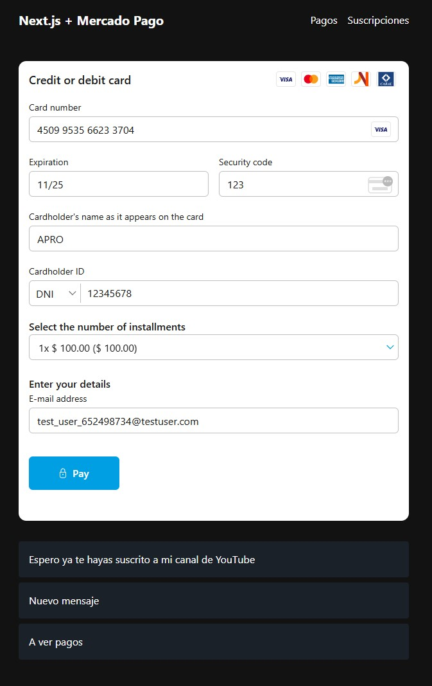
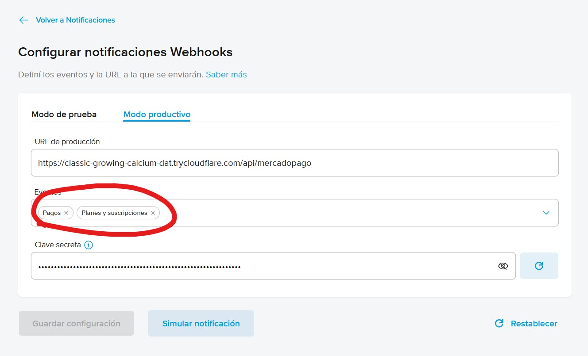

# Integración de Mercado Pago en Next.js

En este respositorio vamos a aprender a integrar Mercado Pago en una aplicación de comentarios utilizando Next.js con App Router. El fin de la aplicación es poder agregar mensajes a una lista de mensajes.

## Indice

Vamos a tener diferentes carpetas y aplicaciones para cada tipo de integración, así mantenemos el código simple y podemos enfocarnos en lo que nos interesa.

1. Prerequisitos
    1. [Configuración de Mercado Pago](./configuracion-mercadopago/README.md): Crear una [integración](https://www.mercadopago.com.ar/developers/panel/app) en Mercado Pago, crear las cuentas de prueba y las integraciones en las cuentas de prueba. Esto es requerido (o al menos recomendado) en todas las integraciones, así que completá esto antes de seguir con una integración.
    2. [Exponer el puerto](./exponer-puerto/README.md): Para que Mercado Pago pueda enviarnos notificaciones sobre los pagos o suscripciones, es necesario exponer nuestro puerto a internet.
2. Integraciones
    1. [Checkout Pro](./checkout-pro/README.md): Los usuarios van a tener que pagar para poder agregar un mensaje a la lista. Usamos [Checkout Pro](https://www.mercadopago.com.ar/developers/es/docs/checkout-pro/landing) para crear una preferencia de pago y redirigir al usuario a Mercado Pago para que pueda pagar. Configuramos un webhook para recibir notificaciones del pago y verificar la autenticidad de la notificación.
    2. [Suscripciones](./suscripciones/README.md): Los usuarios van a tener que suscribirse para poder agregar un mensaje a la lista. Usamos [Suscripciones sin plan asociado con pago pendiente](https://www.mercadopago.com.ar/developers/es/docs/subscriptions/integration-configuration/subscription-no-associated-plan/pending-payments). Configuramos un webhook para recibir notificaciones de suscripción y verificar la autenticidad de la notificación.
    3. [Checkout Bricks](./checkout-bricks/README.md): Los usuarios van a tener que pagar para poder agregar un mensaje a la lista. Usamos [Checkout Bricks](https://www.mercadopago.com.ar/developers/es/docs/checkout-bricks/landing) para tomar los datos de pago dentro de nuestra aplicación.
    4. [Marketplace](./marketplace/README.md): Vamos a ser el intermediario entre un usuario de nuestra aplicación que quiere recibir mensajes en su muro y un usuario que quiere pagar para escribir en ese muro. Vamos a usar Checkout Pro con la integración de [Marketplace](https://www.mercadopago.com.ar/developers/es/docs/checkout-pro/how-tos/integrate-marketplace) para quedarnos con una ganancia por cada mensaje.

## Consideraciones

- Por simplicidad, nuestras aplicaciónes no usan una base de datos real, sino que usa archivos (llamados `db/message.db`, `db/user.db`, etc). Escribir al file system no está permitido en muchos proveedores de hosting, por ende, en un ambiente de producción deberíamos usar una base de datos real, pero para nuestro caso es más que suficiente.
- Las cuentas de prueba no se pueden borrar y son válidas para todas las aplicaciones.
- Los errores en Mercado Pago muchas veces son crípticos y la estabilidad de la API es discutible. Si algo no te anda, intentá más tarde o probá de buscar en el [Discord de Mercado Pago Developers](https://discord.gg/yth5bMKhdn).

## Indice

1. [Crear una integración en Mercado Pago](#crear-una-integración-en-mercado-pago)
    1. [Crear las cuentas de prueba de vendedor y comprador](#crear-las-cuentas-de-prueba-de-vendedor-y-comprador)
    2. [Crear una integración con la cuenta de prueba vendedor](#crear-una-integración-con-la-cuenta-de-prueba-vendedor)
2. [Implementar pagos en nuestra aplicación](#implementar-pagos-en-nuestra-aplicación)
    1. [Crear una preferencia de pago](#crear-una-preferencia-de-pago)
    2. [Realizar un pago de prueba](#realizar-un-pago-de-prueba)
3. [Recibir notificaciones de pagos](#recibir-notificaciones-de-pagos)
    1. [Configurar un webhook de pagos](#configurar-un-webhook-de-pagos)
    2. [Verificar la autenticidad del pago](#verificar-la-autenticidad-del-pago)
4. [Implementar suscripciones](#implementar-suscripciones)
    1. [Crear el componente de Payment Card Brick](#crear-el-componente-de-payment-card-brick)
    2. [Crear una página de suscripciones](#crear-una-página-de-suscripciones)
    3. [Realizar una suscripción de prueba](#realizar-una-suscripción-de-prueba)
    4. [Actualizar la recepción de notificaciones](#actualizar-la-recepción-de-notificaciones)

> [!IMPORTANT]
> El código del proyecto ya está implementado, usá este README para guiarte en la implementación o para entender cómo funciona cada parte y agregarlo a otro proyecto.

## Crear una integración en Mercado Pago

Esta es posiblemente la parte más complicada dado lo confuso que puede ser el flujo de crear y probar nuestra aplicación. Para integrar pagos con Mercado Pago en nuestra aplicación, necesitamos crear una integración. Para eso, vamos a ir a [Mercado Pago Developers](https://www.mercadopago.com.ar/developers/panel/app) y creamos una nueva aplicación.


Una vez dentro, cargamos todos los datos de nuestra aplicación. Vamos a seleccionar `CheckoutPro` en "¿Qué producto estás integrando?" ya que es el método de pago con el que vamos a utilizar (aunque realmente no se si es necesario, ya que vamos a usar Payment Card Brick y Suscripciones también).

Una vez creada la aplicación vamos a ser redirigidos a la pantalla de integración. Como todavía no queremos procesar pagos reales, vamos a dirigirnos a la sección `Credenciales de prueba` que tenemos a la izquierda. Pero, cuando intentamos entrar nos encontramos con esto:


Resulta que no hay credenciales de prueba para `CheckoutPro`, pero, tenemos usuarios de prueba. Dado que en Mercado Pago, no podemos crear una aplicación de la que seamos beneficiarios (recibamos pagos) y pagarnos a nosotros mismos, lo que vamos a tener que hacer es crear dos cuentas de prueba (una para el vendedor o beneficiario y otra para el comprador).

> [!TIP]
> Si solamente querés implementar suscripciones, podés seleccionar `Suscripciones` al crear la aplicación y usar directamente las credenciales de prueba. Dado que acá vamos a usar también Checkout Pro y esta forma funciona para ambos, vamos a tomar el camino largo (pero correcto).

### Crear las cuentas de prueba de vendedor y comprador

Vamos a ir `Cuentas de prueba` en el menú izquierdo y creamos dos cuentas nombradas algo así como `Comprador` y `Vendedor`. A cada una le asignamos el país donde queremos operar y un dinero inicial.


> [!WARNING]
> Las cuentas de prueba no se pueden borrar y son válidas para todas las aplicaciones.

### Crear una integración con la cuenta de prueba vendedor

Ya que nuestra cuenta original de Mercado Pago solo puede manejar pagos reales, vamos a tener que crear una nueva aplicación (como hicimos recientemente) logueandonos con la cuenta de prueba vendedor.

No te preocupes, la aplicación que creamos originalmente es la que vamos a usar para manejar los pagos reales una vez que terminemos de desarrollar y probar la aplicación.

Vamos a abrir la [página de desarrolladores de Mercado Pago](https://www.mercadopago.com.ar/developers/panel/app/) una ventana de incognito y loguearnos en la cuenta de prueba vendedor con el usuario y contraseña correspondientes y creamos una aplicación con los mismos datos (y otro nombre) que la aplicación original.


Después nos vamos a dirigir a `Credenciales de producción` (como es una cuenta de prueba, producción es prueba) y nos copiamos el `Access Token` y `Public Key` y lo pegamos en nuestro archivo `.env.local`.

Finalmente ya tenemos las credenciales para poder usar en nuestra aplicación, espero no haya sido mucho trabajo.

## Implementar pagos en nuestra aplicación

Nuestra aplicación ya tiene un `/src/app/page.tsx` que renderiza un formulario para agregar un mensaje a nuestra lista de mensajes. Al hacer submit ejecuta un server action que muestra en consola el mensaje que queremos agregar:

```tsx
async function add(formData: FormData) {
  "use server";

  const message = formData.get("text") as string;

  console.log(message)
}
```

### Crear una preferencia de pago

En `/src/api.ts` agregamos una función `submit` en `message` que se encargue de crear una preferencia de pago y devolver el init point (url de pago):

```ts
const api = {
  message: {
    async submit(text: string): Promise<string> {
      // Creamos la preferencia incluyendo el precio, titulo y metadata. La información de `items` es standard de Mercado Pago. La información que nosotros necesitamos para nuestra DB debería vivir en `metadata`.
      const preference = await new Preference(mercadopago).create({
        body: {
          items: [
            {
              id: "message",
              unit_price: 100,
              quantity: 1,
              title: "Mensaje de muro",
            },
          ],
          metadata: {
            text,
          },
        },
      });

      // Devolvemos el init point (url de pago) para que el usuario pueda pagar
      return preference.init_point!;
    }
  }
}
```

> [!NOTE]
> Podemos pensar a la preferencia de pago como un objeto que representa una orden de compra. algo que un usuario quiere comprar.

Ahora actualizamos la función `add` para que use la función `submit` de nuestro archivo `/src/api.ts` y envie al usuario a la url de pago:

```tsx
async function add(formData: FormData) {
  "use server";

  const message = formData.get("text") as string;
  const url = await api.message.submit(message);

  redirect(url);
}
```

### Realizar un pago de prueba

Ahora vamos a iniciar sesión con nuestra cuenta de prueba comprador y vamos a intentar pagar por la preferencia de pago que creamos anteriormente.


Bien, nuestro pago fue aprobado y ahora necesitamos que nuestra aplicación sepa de esta transacción para que podamos agregar el mensaje a nuestra lista.

## Recibir notificaciones de pagos

En Mercado Pago no todos los medios de pago son "síncronos", por ende, es necesario configurar una URL de nuestra aplicación a la cual Mercado Pago nos notifique cuando un pago haya sido realizado / rechazado / anulado / etc.

Como Mercado Pago no sabe que es `localhost:3000` (ni tampoco lo que es nuestro equipo local), vamos a tener que exponer el puerto donde corre nuestra aplicación en nuestro equipo local a internet. Yo estoy usando VSCode, por ende voy a usar `Dev Tunnels` para exponer el puerto. Si nos dirigimos a la sección de `Ports` y hacemos click en `Forward a Port`, podemos elegir un puerto (nuestra aplicación corre en el 3000) y nos dará una URL a la cual apuntar nuestro webhook. Asegurate de cambiar la visibilidad de la URL a `Public` para que Mercado Pago pueda acceder a ella.


Si corremos nuestra aplicación con `npm run dev` (habiendo hecho `npm install` previamente) y luego entramos a la URL que nos da el `Dev Tunnel`, deberíamos ver nuestra aplicación corriendo.

Una vez que tengamos esta URL, vamos a agregarla a nuestro `.env.local` en `APP_URL`.

Ahora vamos a crear una ruta en nuestra aplicación que se encargue de recibir las notificaciones de Mercado Pago. Para eso creamos el archivo `src/app/api/mercadopago/route.ts` y agregamos el siguiente contenido:

```ts
export async function POST(req: Request) {
  // Obtenemos el cuerpo de la petición que incluye información sobre la notificación
  const body = await req.json();

  // Vemos su contenido
  console.log(body);

  // Respondemos con un estado 200 para indicarle que la notificación fue recibida
  return new Response(null, {status: 200});
}
```

### Configurar un webhook de pagos

Vamos a ir a Mercado Pago y en la sección de `Webhooks` del panel izquierdo, vamos a crear uno nuevo asegurandonos de estar en `Modo productivo`. En la URL de producción, pegamos la URL que nos da el `Dev Tunnel` (más el endpoint `/api/mercadopago` al final) y seleccionamos `Pagos` en "Eventos".

Si vamos a `Simular notificación` y emitimos, deberíamos ver un mensaje similar a este indicando de que todo está funcionando correctamente y también deberíamos ver un log en la terminal de nuestro equipo local hacia `/api/mercadopago` incluyendo información sobre la notificación.


### Verificar la autenticidad del pago

Si vamos a tomar acciones en nuestra aplicación dependiendo de si un pago fue aprobado o no, es necesario verificar la autenticidad de la notificación que nos llega. También deberíamos verificar que el pago no haya sido procesado previamente.

En nuestro route handler de notificaciones `/src/app/api/mercadopago/route.ts` vamos a importar `mercadopago` y `api` vamos a verificar si el pago es válido para solamente agregar el mensaje cuando lo sea:

```ts
import {Payment, PreApproval} from "mercadopago";
import {revalidatePath} from "next/cache";

import api, {mercadopago} from "@/api";

export async function POST(request: Request) {
  // Obtenemos el cuerpo de la petición que incluye información sobre la notificación
  const body: {data: {id: string}} = await request.json();

  // Obtenemos el pago
  const payment = await new Payment(mercadopago).get({id: body.data.id});

  // Si se aprueba, agregamos el mensaje
  if (payment.status === "approved") {
    // Obtenemos los datos
    await api.message.add({id: payment.id!, text: payment.metadata.text});

    // Revalidamos la página de inicio para mostrar los datos actualizados
    revalidatePath("/");

    // Respondemos con un estado 200 para indicarle que la notificación fue recibida
    return new Response(null, {status: 200});
  } else {
    // Respondemos con un estado 400 para indicarle que la notificación no fue resuelta
    return new Response(null, {status: 400});
  }
}
```

De esta manera, solamente vamos a agregar el mensaje a nuestra lista si el pago es legítimo, fue aprobado y no existe ya un mensaje con ese id (esto último se valida en `api.message.add`).

> [!TIP]
> En una aplicación real deberíamos verificar la concordancia de la clave secreta, devolver errores más descriptivos y más, pero por simplicidad y tiempo te voy a dejar esa tarea a vos, podés ver más [acá](https://www.mercadopago.com.ar/developers/es/docs/your-integrations/notifications/webhooks#configuracinatravsdetusintegraciones).

Ahora vamos a intentar de hacer el flujo completo de agregar un mensaje a nuestra lista de mensajes y veamos si funciona.


Excelente, nuestro pago fue aprobado, el webhook fue recibido y nuestro mensaje fue agregado a la lista ✨.

## Implementar suscripciones

A la hora de implementar suscripciones podemos hacerlo mediante [Suscripciones con plan asociado](https://www.mercadopago.com.ar/developers/es/docs/subscriptions/integration-configuration/subscription-associated-plan) o [Suscripciones sin plan asociado](https://www.mercadopago.com.ar/developers/es/docs/subscriptions/integration-configuration/subscription-no-associated-plan). Las primeras son bastante sencillas de implementar: Se crea un plan con valor, nombre y un par de datos más y listo, nos da una URL similar a lo que hace una preferencia. El problema es que este preferencia no recibe datos de referencia o metadatos que podamos usar para identificar a nuestro usuario cuando hace el pago, así que vamos a usar la segunda opción.

### Crear el componente de Payment Card Brick

Los Checkout Bricks son un conjunto de componentes de cliente que nos permiten simplificar un poco el flujo de pagos con Mercado Pago. En este caso, el Payment Card Brick nos permite tomar los datos de una tarjeta y recibir un token de Mercado Pago con el que podrémos crear la suscripción.

Vamos a crear un archivo `/src/app/suscripciones/card-brick.tsx` y vamos a agregar el siguiente contenido:

```tsx
"use client";

import type {
  ICardPaymentBrickPayer,
  ICardPaymentFormData,
} from "@mercadopago/sdk-react/bricks/cardPayment/type";

import {useEffect} from "react";
import {initMercadoPago, CardPayment} from "@mercadopago/sdk-react";

export default function CardBrick({
  onSubmitAction,
  amount,
}: {
  onSubmitAction: (param: ICardPaymentFormData<ICardPaymentBrickPayer>) => Promise<void>;
  amount: number;
}) {
  useEffect(() => {
    // Inicializamos el SDK
    initMercadoPago(process.env.NEXT_PUBLIC_MP_PUBLIC_KEY!);

    // Desmontamos el componente de bricks cuando se desmonte el componente
    return () => {
      window?.cardPaymentBrickController?.unmount();
    };
  }, []);

  // Renderizamos el componente de bricks
  return <CardPayment initialization={{amount}} onSubmit={onSubmitAction} />;
}
```

Este componente se encarga de inicializar el SDK de Mercado Pago usando el Public Key de nuestra aplicación (que cargamos en nuestro `.env.local`) y renderizar un formulario para tomar los datos de una tarjeta y ejecutar la función `onSubmit` cuando el pago es realizado correctamente.

### Crear una página de suscripciones

Vamos a crear una nueva ruta `/suscripciones` creando el archivo `/src/app/suscripciones/page.tsx` con el siguiente contenido:

```tsx
import type {
  ICardPaymentBrickPayer,
  ICardPaymentFormData,
} from "@mercadopago/sdk-react/bricks/cardPayment/type";

import {revalidatePath} from "next/cache";

import CardBrick from "./card-brick";

import api from "@/api";

// Queremos que esta página sea dinámica para siempre poder ver la información actualizada del usuario
export const dynamic = "force-dynamic";

export default async function SuscripcionesPage() {
  // Obtenemos el usuario y los mensajes
  const user = await api.user.fetch();
  const messages = await api.message.list();

  // Creamos una función para agregar un mensaje
  async function add(formData: FormData) {
    "use server";

    // Obtenemos el mensaje del formulario
    const message = formData.get("text") as string;

    // Agregamos el mensaje a la base de datos
    await api.message.add({text: message, id: Date.now()});

    // Revalidamos la ruta para que se actualice la información
    revalidatePath("/suscripciones");
  }

  async function subscribe(data: ICardPaymentFormData<ICardPaymentBrickPayer>) {
    "use server";

    // Creamos una suscripción usando los datos que nos devolvió el Checkout Brick
    await api.user.subscribe(data.payer.email!, data.token);

    // Revalidamos la ruta para poder ver el formulario de agregar mensaje
    revalidatePath("/suscripciones");
  }

  return (
    <section className="grid gap-8">
      {user.suscription ? (
        <form action={add} className="grid gap-2">
          <textarea
            className="border-2 border-blue-400 p-2"
            name="text"
            placeholder="Hola perro"
            rows={3}
          />
          <button className="rounded bg-blue-400 p-2" type="submit">
            Enviar
          </button>
        </form>
      ) : (
        <CardBrick amount={100} onSubmitAction={subscribe} />
      )}
      <ul className="grid gap-2">
        {messages.map((message) => (
          <li key={message.id} className="rounded bg-blue-400/10 p-4">
            {message.text}
          </li>
        ))}
      </ul>
    </section>
  );
}
```

Esta ruta va a mostrar una UI diferente basado en si el usuario tiene una suscripción activa o no. Si no la tiene, va a renderizar el Payment Card Brick para que el usuario pueda suscribirse. Si la tiene, va a renderizar un formulario para agregar un mensaje a nuestra lista de mensajes.

También crea un Server Action llamado `subscribe` que se lo vamos a pasar al componente `CardBrick`. Este action se va a ejecutar cuando hagamos `submit` en el Brick y se va a encargar de crear una suscripción usando el token e email que nos devuelve el Brick.

### Realizar una suscripción de prueba

Vamos a iniciar sesión con nuestra cuenta de prueba comprador y vamos a intentar suscribirnos a nuestro plan. Si vamos a `http://localhost:3000/suscripciones` vamos a ver el Payment Card Brick.

Vamos a llenar los datos con la tarjeta de prueba de Mercado Pago de nuestro usuario comprador (si no los podes ver, creá una aplicación con la cuenta compradora y andá a `Tarjetas de prueba`).



> [!WARNING]
> Para que me funcione este flujo tuve que usar la tarjeta de Visa, el nombre APRO, DNI 12345678 y el mail debe ser el del usuario de prueba (lo pueden obtener desde el perfil del usuario de prueba)

Una vez hecho el submit, deberíamos ver el formulario para agregar un mensaje.

### Actualizar la recepción de notificaciones

Vamos a actualizar nuestro webhook en la aplicación de prueba del vendedor para también recibir notificaciones de nuestras suscripciones.



Una vez hecho esto, vamos a `/src/app/api/mercadopago/route.ts` y vamos a agregar la lógica para recibir notificaciones de suscripciones. Vamos a tener una cadena de ifs para verificar el tipo de notificación y actuar en consecuencia:

```ts
export async function POST(request: Request) {
  // Obtenemos el cuerpo de la petición que incluye el tipo de notificación
  const body: {type: string; data: {id: string}} = await request.json();

  // Dependiendo del tipo de notificación, llamamos a la función correspondiente
  if (body.type.startsWith("payment")) {
    return handlePaymentNotification(body);
  } else if (body.type.startsWith("subscription")) {
    return handlePreapprovalNotification(body);
  } else {
    return new Response(null, {status: 400});
  }
}
```

Una vez hecho esto, vamos a implementar ambas funciones:

```ts
import {Payment, PreApproval} from "mercadopago";
import {revalidatePath} from "next/cache";

import api, {mercadopago} from "@/api";

async function handlePaymentNotification(body: {data: {id: string}}) {
  // Obtenemos el pago
  const payment = await new Payment(mercadopago).get({id: body.data.id});

  // Si se aprueba, agregamos el mensaje
  if (payment.status === "approved") {
    // Obtenemos los datos
    await api.message.add({id: payment.id!, text: payment.metadata.text});

    // Revalidamos la página de inicio para mostrar los datos actualizados
    revalidatePath("/");

    // Respondemos con un estado 200 para indicarle que la notificación fue recibida
    return new Response(null, {status: 200});
  } else {
    // Respondemos con un estado 400 para indicarle que la notificación no fue resuelta
    return new Response(null, {status: 400});
  }
}

async function handlePreapprovalNotification(body: {data: {id: string}}) {
  // Obtenemos la suscripción
  const preapproval = await new PreApproval(mercadopago).get({id: body.data.id});

  // Si se aprueba, actualizamos el usuario con el id de la suscripción
  if (preapproval.status === "authorized") {
    // Actualizamos el usuario con el id de la suscripción
    await api.user.update({suscription: preapproval.id});

    // Respondemos con un estado 200 para indicarle que la notificación fue recibida
    return new Response(null, {status: 200});
  } else {
    // Respondemos con un estado 400 para indicarle que la notificación no fue resuelta
    return new Response(null, {status: 400});
  }
}
```

El manejo de notificaciones de suscripciones es muy similar al de pagos, la diferencia está en que en las suscripciones el status es `authorized` en vez de `approved`.

> [!IMPORTANT]
> En una aplicación real deberíamos tener más control sobre la suscripción, verificar su estado, cancelarla, asegurarnos de que no esté duplicada, etc. Pero esa tarea te la dejo a vos.

Perfecto, ahora si todo está funcionando correctamente ✨.

---

Si te gusta mi contenido, seguime en [Twitter](https://twitter.gonzalopozzo.com), en [Twitch](https://twitch.gonzalopozzo.com), en [YouTube](https://youtube.gonzalopozzo.com), doname un [Cafecito](https://cafecito.gonzalopozzo.com) o volvete [sponsor en github](https://github.com/sponsors/goncy) ✨
