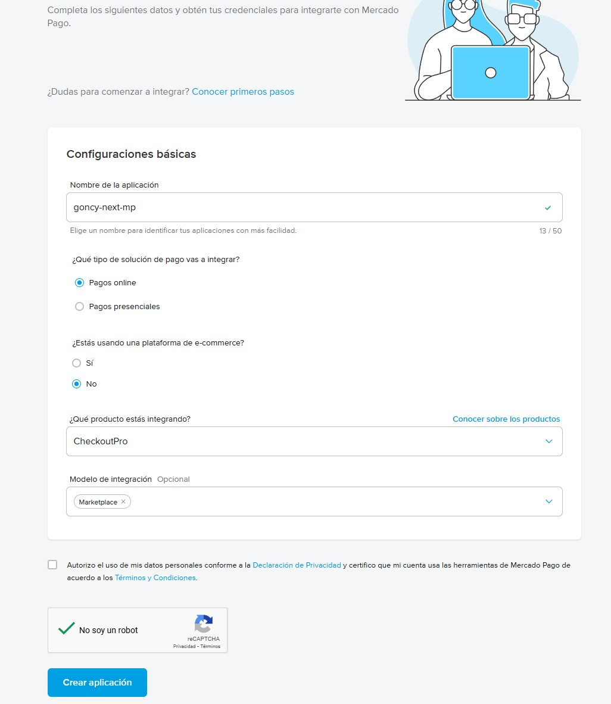

# Crear aplicación de Mercado Pago

En este documento vamos a ver como crear una aplicación en Mercado Pago para luego usar en nuestra aplicación Next.js. Cada aplicación de Mercado Pago tiene un conjunto de credenciales, configuraciones y nos permite configurar notificaciones de eventos relacionados con transacciones.

Vamos a ir a [Mercado Pago Developers](https://www.mercadopago.com.ar/developers/panel/app) y creamos una nueva aplicación.

Una vez dentro, cargamos todos los datos de nuestra aplicación. En "¿Qué producto estás integrando?" vas a elegir el que quieras integrar.

Una vez creada la aplicación vamos a ser redirigidos a la pantalla de integración.

---

[Volver al inicio](../../README.md)
