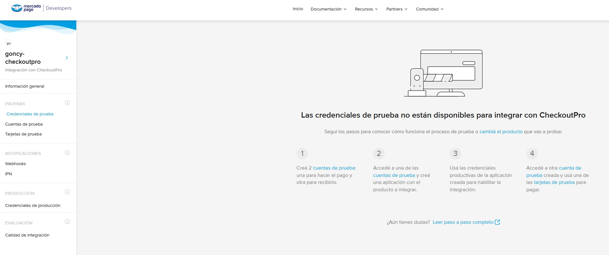
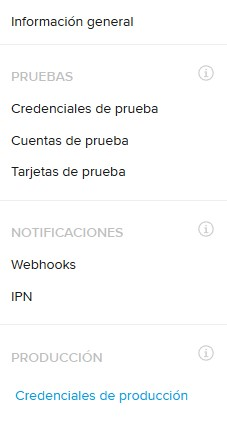

# Credenciales

Las credenciales son las claves, públicas o privadas, que vamos a usar desde nuestra aplicación Next.js para interactuar con Mercado Pago.

Las credenciales pueden ser de dos tipos:

- **Credenciales de producción**: Usamos estas credenciales para interactuar con Mercado Pago en un entorno real.
- **Credenciales de prueba**: Usamos estas credenciales para interactuar con Mercado Pago en un entorno de pruebas.

Pero no todo es tan simple... En algunas integraciones, como `Checkout Bricks` o `Suscripciones`, vamos a crear una aplicación y durante la etapa de desarrollo vamos a usar las credenciales de prueba de esa aplicación.

Pero para otras integraciones, como `Checkout Pro` o `Marketplace`...

Vamos a tener que iniciar sesión con una cuenta de prueba (generalmente la cuenta de Vendedor) y crear una aplicación, de la misma manera que lo haríamos con una cuenta real, para usar las credenciales de **producción** de esa aplicación durante la etapa de desarrollo. Vamos a usar las credenciales de **producción** de nuestra cuenta de **prueba**, porque en en una cuenta de **prueba** producción es **prueba**.

No me mires a mi, yo no hice las reglas...

Dependiendo de cuales nescesites, una vez hayas ingresado a tu aplicación, vas a encontrar en el panel izquierdo los links a `Credenciales de producción` o `Credenciales de prueba` de tu aplicación.

Por suerte muchas veces, dependiendo de que tipo de integración hayas elegido o en que tipo de cuenta estes, los links a las credenciales que no puedas usar van a estar deshabilitados o te va a indicar si tenes que crear una aplicación desde una cuenta de prueba.

---

[Volver al inicio](../../README.md)