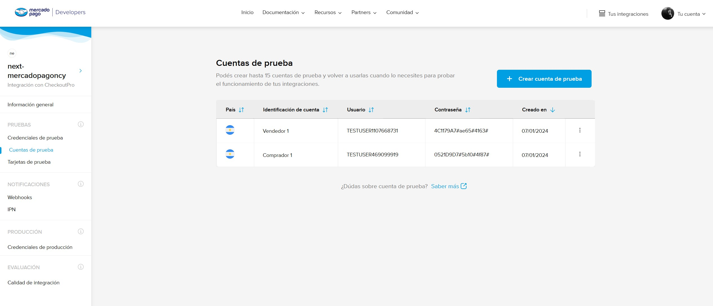
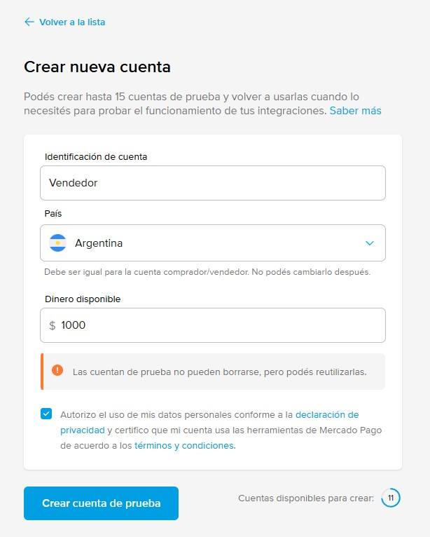
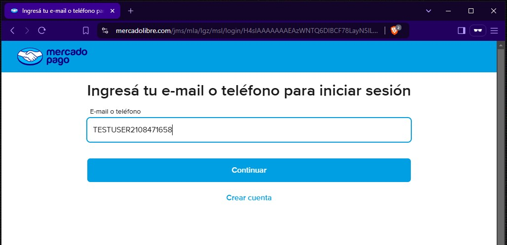
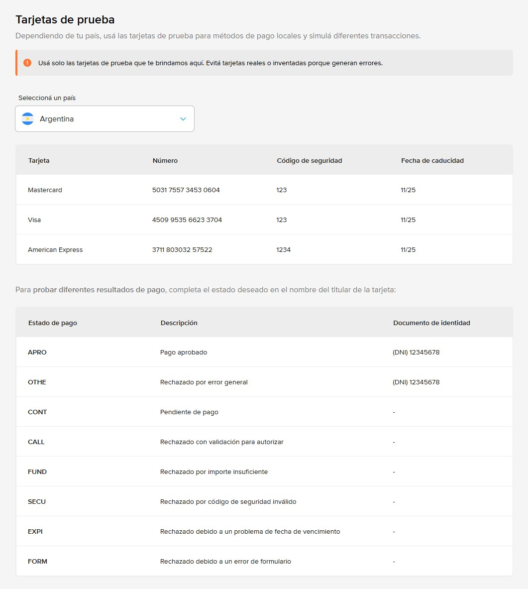

# Cuentas de prueba

Las cuentas de prueba son importantes durante el periodo de desarrollo ya que como estamos manejando dinero, las interacciones de nuestra aplicación deberían ser entre cuentas de prueba con dinero ficticio.

## Índice

- [Crear cuentas de prueba](#crear-cuentas-de-prueba)
- [Tarjetas de prueba](#tarjetas-de-prueba)
- [Credenciales](#credenciales)

## Crear cuentas de prueba

Vamos a ir `Cuentas de prueba` en el menú izquierdo y tocamos el botón de `Crear cuenta de prueba`.

Vamos a darle un nombre, un país y un monto inicial de crédito a la cuenta.

> [!TIP]
> Generalmente vas a necesitar al menos dos cuentas de prueba: una para el `Vendedor` y otra para el `Comprador`. En algunos casos, como el de `Marketplace`, vas a necesitar una tercer cuenta para representar al `Intermediario` que no es ni comprador ni vendedor.

Luego abrimos una ventana de incognito y nos logueamos con la cuenta de prueba desde el navegador de esa cuenta para asegurarnos de que la creamos correctamente.

Ahora ya podemos usar la cuenta de prueba para interactuar con nuestras aplicaciones.

## Tarjetas de prueba

La mayoría de las veces vamos a poder pagar con dinero en cuenta, pero si quisieramos hacer pagos de prueba con tarjetas, una vez que iniciamos sesión con nuestra cuenta de pruebas, entramos a [alguna de sus aplicaciones](https://www.mercadopago.com.ar/developers/panel/app/) (o creamos una aplicación si no la tenemos) y nos vamos a `Tarjetas de prueba`.

Acá no solo vamos a encontrar un listado de tarjetas de prueba, sino que nombre y DNI deberíamos usar para cada una. Con nombres como `APRO` podemos hacer que nuestros pagos sean aceptados o podríamos usar otro como `OTHE` o `CONT` para ver como se comportaría nuestra aplicación frente a pagos rechazados o pendientes.

> [!TIP]
> En mi experiencia la tarjeta de Visa es la que mejor funciona.

---

[Volver al inicio](../../README.md)