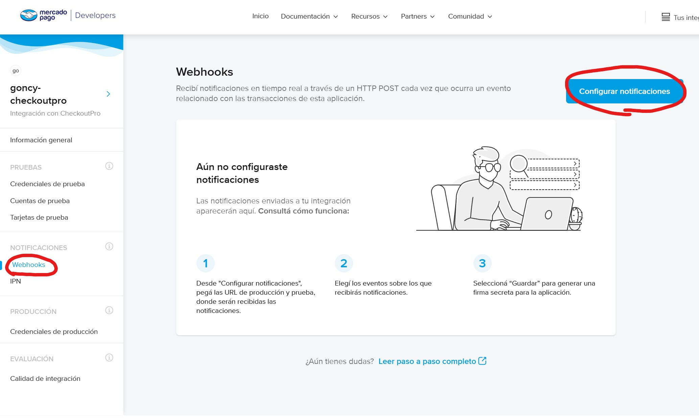
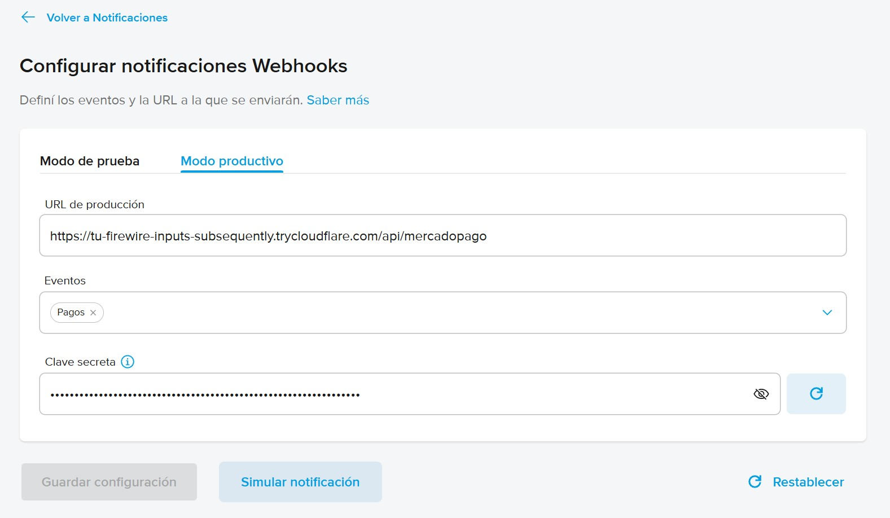
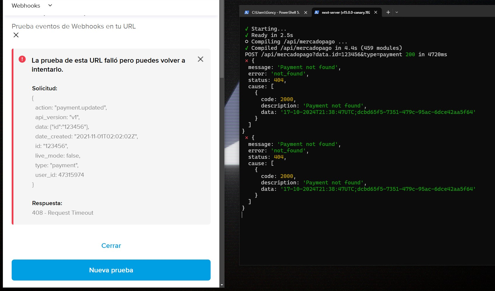

# Configurar un webhook para recibir notificaciones de pago y suscripciones

Para poder configurar un webhook en Mercado Pago, primero necesitamos [exponer nuestro puerto en local hacia internet](../exponer-puerto/README.md). Si todavía no lo hiciste, hacelo y volvé.

Vamos a ir a [Mercado Pago](https://www.mercadopago.com.ar/developers/panel/app) e ingresamos a la aplicación de la cual queremos recibir notificaciones. Luego seleccionamos la sección de `Webhooks` del panel izquierdo y clickeamos el botón de `Configurar notificaciones`:

Seleccioná el entorno del cual quieras recibir notificaciones (recordá que si estás en una cuenta de prueba, posiblemente quieras seleccionar `Modo productivo`) y en la URL de producción, pegamos la URL que tenemos en `APP_URL` dentro de nuestro archivo `.env.local` (la que obtuvimos cuando expusimos nuestro puerto local más arriba) y le agregamos el endpoint al que queremos que nos llegen las notificaciones. Por ejemplo, en este tutorial, las notificaciones las recibo en `/api/mercadopago`. Seleccionamos los eventos que queremos recibir y le damos a `Guardar configuración`:

Si vamos a `Simular notificación` y emitimos una notificación, deberíamos ver un mensaje similar a este indicando de que hubo un error (ya que el pago no existe) y también deberíamos ver un log en la terminal de nuestro equipo local incluyendo información sobre la notificación.

Si bien "no funcionó", nos sirve por que sabemos que Mercado Pago puede comunicarse con nuestra aplicación.

---

[Volver al inicio](../../README.md)