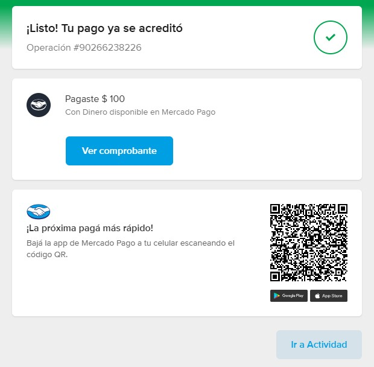

# Integración de Mercado Pago con Checkout Pro

En este documento vamos a aprender a agregar pagos a nuestra aplicación utilizando Mercado Pago Checkout Pro. Los usuarios van a poder agregar mensajes a una lista de mensajes pagando por cada mensaje.

Antes de continuar, asegurate de haber [creado una aplicación en Mercado Pago](../../configuracion/crear-aplicacion/README.md), haber creado dos [cuentas de prueba](../../configuracion/cuentas-de-prueba/README.md) para Comprador y Vendedor, haber [expuesto el puerto 3000 al exterior](../../configuracion/exponer-puerto/README.md) y haber [configurado un webhook](../../configuracion/webhook/README.md) para escuchar eventos de `Pagos`.

## Video

[](https://www.youtube.com/watch?v=BUHUW7tAr_Y)

## Indice

1. [Revisando nuestra aplicación](#revisando-nuestra-aplicación)
2. [Crear una preferencia de pago](#crear-una-preferencia-de-pago)
3. [Recibir notificaciones de pagos](#recibir-notificaciones-de-pagos)
4. [Verificar la autenticidad del pago](#verificar-la-autenticidad-del-pago)
5. [Probar la integración](#probar-la-integración)

## Revisando nuestra aplicación

En la página de inicio de nuestra aplicación (`/src/app/page.tsx`) se renderiza un formulario para agregar un mensaje a nuestra lista de mensajes. Al hacer submit de este formulario, se ejecuta un Server Action que obtiene una URL de Mercado Pago a la cual vamos a redirigir al usuario para que pueda pagar:

```tsx
import {redirect} from "next/navigation";

import api from "@/api";

// Queremos que esta página sea estática, nos encargaremos de revalidar los datos cuando agreguemos un nuevo mensaje
export const dynamic = "force-static";

export default async function HomePage() {
  const messages = await api.message.list();

  async function add(formData: FormData) {
    "use server";

    const message = formData.get("text") as string;
    const url = await api.message.submit(message);

    redirect(url);
  }

  return (
    <section className="grid gap-8">
      <form action={add} className="grid gap-2">
        <textarea
          className="border-2 border-blue-400 p-2"
          name="text"
          placeholder="Hola perro"
          rows={3}
        />
        <button className="rounded bg-blue-400 p-2" type="submit">
          Enviar
        </button>
      </form>
      <ul className="grid gap-2">
        {messages.map((message) => (
          <li key={message.id} className="rounded bg-blue-400/10 p-4">
            {message.text}
          </li>
        ))}
      </ul>
    </section>
  );
}
```

## Crear una preferencia de pago

Dentro de `/src/api.ts`, la función `submit` en `message` se encarga de crear una preferencia de pago y devolver el init point (url de pago):

```ts
const api = {
  message: {
    async submit(text: string): Promise<string> {
      // Creamos la preferencia incluyendo el precio, titulo y metadata. La información de `items` es standard de Mercado Pago. La información que nosotros necesitamos para nuestra DB debería vivir en `metadata`.
      const preference = await new Preference(mercadopago).create({
        body: {
          items: [
            {
              id: "message",
              unit_price: 100,
              quantity: 1,
              title: "Mensaje de muro",
            },
          ],
          metadata: {
            text,
          },
        },
      });

      // Devolvemos el init point (url de pago) para que el usuario pueda pagar
      return preference.init_point!;
    }
  }
}
```

Podemos pensar a la preferencia de pago como un objeto que representa una orden de compra. algo que un usuario quiere comprar.

Hay varias propiedades más que podemos agregar a la preferencia de pago, como la URL a la cual se va a redirigir al usuario luego de pagar. Una descripción más extensa del producto, etc. Podés ver más [acá](https://www.mercadopago.com.ar/developers/es/reference/preferences/_checkout_preferences/post).

## Recibir notificaciones

Tenemos un Route Handler (`src/app/api/mercadopago/route.ts`) definido en nuestra aplicación que se encarga de recibir las notificaciones de Mercado Pago.

```ts
import {Payment} from "mercadopago";
import {revalidatePath} from "next/cache";

import api, {mercadopago} from "@/api";

export async function POST(request: Request) {
  // Obtenemos el cuerpo de la petición que incluye información sobre la notificación
  const body: {data: {id: string}} = await request.json();

  // Obtenemos el pago
  const payment = await new Payment(mercadopago).get({id: body.data.id});

  // Si se aprueba, agregamos el mensaje
  if (payment.status === "approved") {
    // Obtenemos los datos
    await api.message.add({id: payment.id!, text: payment.metadata.text});

    // Revalidamos la página de inicio para mostrar los datos actualizados
    revalidatePath("/");
  }

  // Respondemos con un estado 200 para indicarle que la notificación fue recibida
  return new Response(null, {status: 200});
}
```

> [!NOTE]
> Es importante siempre retornar un estado 200 para indicarle a Mercado Pago que la notificación fue recibida. Solo debemos retornar un estado que no sea 200 cuando hubo algún error por el cual queremos que Mercado Pago nos notifique nuevamente.

## Verificar la autenticidad del pago

Este Route Handler va a recibir las notificaciones de pago de Mercado Pago, va a obtener el pago usando el ID que nos llega en la notificación. En caso de que el pago sea aprobado, va a agregar el mensaje a nuestra lista de mensajes y va a revalidar la página de inicio para que se muestren los mensajes actualizados.

De esta manera nos aseguramos de que el pago exista y haya sido aprobado. También nuestro método `api.message.add` se encarga de validar que no exista un mensaje con el mismo ID, para que no se dupliquen.

```ts
// Si ya existe un mensaje con ese id, lanzamos un error
if (db.some((_message) => _message.id === message.id)) {
  throw new Error("Message already added");
}
```

En una aplicación real deberíamos verificar la concordancia de la clave secreta, devolver errores más descriptivos y más, pero por simplicidad y tiempo te voy a dejar esa tarea a vos, podés ver más [acá](https://www.mercadopago.com.ar/developers/es/docs/your-integrations/notifications/webhooks#configuracinatravsdetusintegraciones).

## Probar la integración

Ahora vamos a intentar de hacer el flujo completo de agregar un mensaje a nuestra lista de mensajes y veamos si funciona.



Excelente, nuestro pago fue aprobado, la notificación fue recibida y nuestro mensaje fue agregado a la lista ✨.

---

[Volver al inicio](../../README.md)
