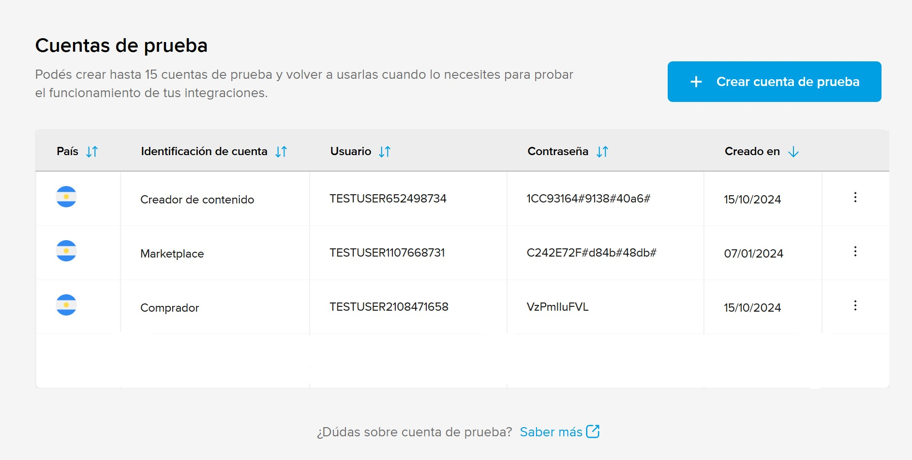
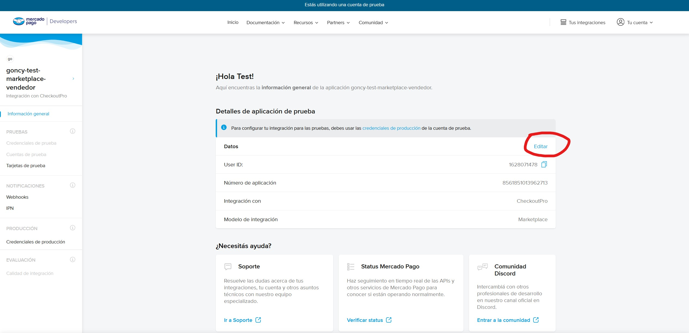

# Integración de Mercado Pago con Checkout Pro y Split de pagos (Marketplace)

En este documento vamos a aprender a agregar pagos a nuestra aplicación utilizando Mercado Pago Checkout Pro con la funcionalidad de Marketplace. Los usuarios van a poder agregar mensajes a una lista de mensajes pagando por cada mensaje y el intermediario (Marketplace) se queda con una parte de la venta.

Un caso de uso para esta implementación sería una plataforma como [Cafecito](https://cafecito.app/). Donde hay creadores de contenido (Vendedor), un comprador para ese contenido (Comprador) y la plataforma que se queda con una parte por el valor agregado (Marketplace).

La implementación de esta funcionalidad es muy similar a la integracion con Checkout Pro, así que para poder seguir, primero completá todos los pasos de la [Integración de Mercado Pago con Checkout Pro](../checkout-pro/README.md).

## Índice

1. [Crear una cuenta de prueba extra para Marketplace](#crear-una-cuenta-de-prueba-extra-para-marketplace)
2. [Configurando la URL de redirección](#configurando-la-url-de-redirección)
3. [Revisando nuestra aplicación](#revisando-nuestra-aplicación)
4. [Obtener la URL de autorización](#obtener-la-url-de-autorización)
5. [Autorizar la integración](#autorizar-la-integración)
6. [Guardar el access token autorizado](#guardar-el-access-token-autorizado)
7. [Crear una preferencia de pago en nombre del creador de contenido](#crear-una-preferencia-de-pago-en-nombre-del-creador-de-contenido)
8. [Probar la integración](#probar-la-integración)

## Crear una cuenta de prueba extra para Marketplace

Como en este proceso hay 3 partes (Comprador, Vendedor y Marketplace), crear una cuenta de prueba más. Ya teníamos la de Comprador y Vendedor, vamos a crear una cuenta nueva llamada `Creador de contenido` y renombremos la de `Vendedor` como `Marketplace`.



No es estrictamente necesario renombrar la cuenta, pero como ya tenemos la aplicación creada y configurada en la cuenta de Vendedor, es más claro tener los roles diferenciados.

## Configurando la URL de redirección

En este proceso vamos a hacer que el usario "Creador de contenido" autorice al usuario "Marketplace" a crear preferencias de pago en su nombre. Esto se hace mediante OAuth, donde luego de que el usuario "Creador de contenido" autorice la integración, se lo redirigirá a una URL de nuestra aplicación, la cual debemos configurar en Mercado Pago.

En Mercado Pago, dentro del panel de administración de nuestra aplicación en nuestra cuenta de `Marketplace`, vamos al link que dice `editar`.



Nos vamos a desplazar hacia abajo y en `URLs de redireccionamiento` vamos a agregar la URL de nuestra aplicación (la que tenemos en `APP_URL` en nuestro archivo `.env.local`) y le agregamos `/api/mercadopago/connect` al final. Vamos a ver que hace esa ruta más adelante.


## Revisando nuestra aplicación

En la página de inicio de nuestra aplicación (`/src/app/page.tsx`) si el usuario ya autorizó la integración, se renderiza el formulario para agregar un mensaje, de la misma manera que lo hacemos en la integración de Checkout Pro. Sino, se renderiza un link que nos redirige a Mercado Pago para que autorice la integración:

```tsx
import {redirect} from "next/navigation";

import api from "@/api";

// Queremos que esta página sea dinámica para saber el estado del marketplace
export const dynamic = "force-dynamic";

export default async function MarketplacePage() {
  // Obtenemos el usuario y los mensajes
  const user = await api.user.fetch();
  const messages = await api.message.list();

  // Obtenemos la URL de autorización
  const authorizationUrl = await api.user.authorize();

  // Creamos una preferencia de pago y redirigimos al usuario a Mercado Pago
  async function add(formData: FormData) {
    "use server";

    const message = formData.get("text") as string;
    const url = await api.message.submit(message);

    redirect(url);
  }

  return (
    <section className="grid gap-8">
      {/* Si el usuario ya autorizó la integración, mostramos el formulario */}
      {user.marketplace ? (
        <form action={add}>
          <textarea
            name="text"
            placeholder="Hola perro"
            rows={3}
          />
          <button type="submit">
            Enviar
          </button>
        </form>
      ) : (
        // Si no autorizó la integración, mostramos un botón para redirigirlo a Mercado Pago a autorizar
        <a href={authorizationUrl}>
          Conectar Mercado Pago
        </a>
      )}
      <ul className="grid gap-2">
        {messages.map((message) => (
          <li key={message.id}>
            {message.text}
          </li>
        ))}
      </ul>
    </section>
  );
}
```

## Obtener la URL de autorización

Dentro de `/src/api.ts`, la función `authorize` en `user` se encarga de generar la URL a donde vamos a redirigir al usuario para que autorice al Marketplace a crear preferencias de pago en su nombre:

```ts
const api = {
  user: {
    async authorize() {
      // Obtenemos la url de autorización
      const url = new OAuth(mercadopago).getAuthorizationURL({
        options: {
          client_id: process.env.NEXT_PUBLIC_MP_CLIENT_ID,
          redirect_uri: `${process.env.APP_URL}/api/mercadopago/connect`,
        },
      });

      // Devolvemos la url
      return url;
    },
  }
}
```

> [!IMPORTANT]
> Para esta integración necesitamos que `NEXT_PUBLIC_MP_CLIENT_ID` esté definido en nuestro archivo `.env.local`. Recordá tomarlo desde la aplicación que creaste desde tu cuenta Marketplace.

## Autorizar la integración

Si vamos a nuestra aplicación, vamos a ver un botón que dice `Conectar Mercado Pago`. Asegurate de clickear ese link mientras estás logueado como `Creador de contenido`. Esto nos va a redirigir a Mercado Pago donde nos va a preguntar a que país correspondemos y luego vas a ver una pantalla como esta:


Vamos a continuar, aceptar y vamos a ser redirigidos a nuestra aplicación, donde vamos a ver el formulario para agregar un mensaje.

## Guardar el access token autorizado

Una vez que el usuario fue autorizado, es redirigido a nuestra aplicación hacia la ruta `/api/mercadopago/connect` junto con un parámetro `code` en la URL:

```ts
import {NextRequest, NextResponse} from "next/server";

import api from "@/api";

export async function GET(request: NextRequest) {
  // Obtenemos el code de la request
  const code = request.nextUrl.searchParams.get("code");

  // Conectamos al usuario con el code y obtenemos las credenciales
  const credentials = await api.user.connect(code!);

  // Actualizamos las credenciales del usuario
  await api.user.update({marketplace: credentials.access_token});

  // Redirigimos al usuario a la página del marketplace
  return NextResponse.redirect(process.env.APP_URL!);
}
```

Vamos a extraer ese parametro y se lo pasamos a la función `connect` en `user` para obtener las credenciales del usuario, incluyendo un access token que nos permite crear preferencias de pago en nombre del creador de contenido.

Luego actualizamos el usuario con el access token para poder accederlo desde nuestra aplicación y redirigimos al usuario nuevamente a la página de inicio.

> [!NOTE]
> Las credenciales incluyen más información, como un refresh token, cuando vence y más. En una aplicación real deberíamos guardar ambos e intercambiar el refresh token por un nuevo access token cuando este expire. Pero esa tarea te la dejo a vos.

Dentro de `/src/api.ts`, la función `connect` en `user` se encarga de intercambiar el code por esas credenciales que luegos guardamos en el usuario:

```ts
const api = {
  message: {
    async connect(code: string) {
      // Obtenemos las credenciales del usuario usando el code que obtuvimos de oauth
      const credentials = await new OAuth(mercadopago).create({
        body: {
          client_id: process.env.NEXT_PUBLIC_MP_CLIENT_ID,
          client_secret: process.env.MP_CLIENT_SECRET,
          code,
          redirect_uri: `${process.env.APP_URL}/api/mercadopago/connect`,
        },
      });

      // Devolvemos las credenciales
      return credentials;
    },
  }
}
```

## Crear una preferencia de pago en nombre del creador de contenido

Dentro de `/src/api.ts`, la función `submit` en `message` se encarga de crear una preferencia de pago y devolver el init point (url de pago). Pero no vamos a usar nuestro cliente de Mercado Pago como veníamos haciendo antes, sino que vamos a crear un nuevo cliente usando el access token del Marketplace. Entonces, cuando creemos esa preferencia, el pago va a ir para el creador de contenido, pero va a retener un valor fijo (el definido en `marketplace_fee`) como comisión para el usuario Marketplace:

```ts
const api = {
  message: {
    async submit(text: Message["text"], marketplace: string) {
      // Creamos el cliente de Mercado Pago usando el access token del Marketplace
      const client: MercadoPagoConfig = new MercadoPagoConfig({accessToken: marketplace});

      // Creamos la preferencia incluyendo el precio, titulo y metadata. La información de `items` es standard de Mercado Pago. La información que nosotros necesitamos para nuestra DB debería vivir en `metadata`.
      const preference = await new Preference(client).create({
        body: {
          items: [
            {
              id: "message",
              unit_price: 100,
              quantity: 1,
              title: "Mensaje de muro",
            },
          ],
          metadata: {
            text,
          },
          // Le agregamos ARS 5 de comisión
          marketplace_fee: 5,
        },
      });

      // Devolvemos el init point (url de pago) para que el usuario pueda pagar
      return preference.init_point!;
    }
  }
}
```

## Probar la integración

Ya que usamos como base la integración de Checkout Pro, deberíamos tener la configuración del webhook de notificaciones de pago configurado. Por ende, si ya estamos conectados a Mercado Pago, deberíamos poder agregar un mensaje, recordá estar logeado con la tercer cuenta, la de Comprador (que no es ni Marketplace ni Creador de contenido).


Una vez que el pago fue aprobado, deberíamos ver el mensaje en la lista. Y si nos fijamos en la actividad de cuenta de Mercado Pago del Creador de contenido, deberíamos ver el pago con el detalle indicando la comisión que se queda el Marketplace.


---

[Volver al inicio](../../README.md)
