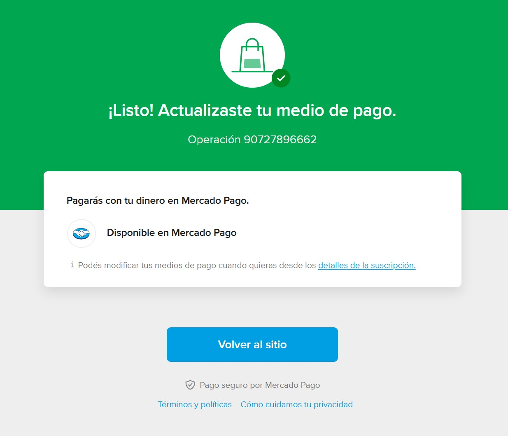

# Integración de Mercado Pago con Suscripciones

En este documento vamos a aprender a agregar suscripciones a nuestra aplicación utilizando [Suscripciones sin plan asociado con pago pendiente](https://www.mercadopago.com.ar/developers/es/docs/subscriptions/integration-configuration/subscription-no-associated-plan/pending-payments). Los usuarios van a poder agregar mensajes a una lista de mensajes siempre y cuando estén suscritos.

Antes de continuar, asegurate de haber [clonado el proyecto](../../configuracion/clonar-aplicacion/README.md), [creado una aplicación en Mercado Pago](../../configuracion/crear-aplicacion/README.md) (para producción), haber creado dos [cuentas de prueba](../../configuracion/cuentas-de-prueba/README.md) para Comprador y Vendedor, haber iniciado sesión en otro navegador con la cuenta de prueba de Vendedor y [crear una aplicación en Mercado Pago](../../configuracion/crear-aplicacion/README.md) (para desarrollo), haber [copiado las credenciales](../../configuracion/credenciales/README.md) de producción de la aplicación del Vendedor a tu archivo `.env.example` y renombrarlo a `.env.local`, haber [expuesto el puerto 3000 al exterior](../../configuracion/exponer-puerto/README.md) y haber [configurado un webhook](../../configuracion/webhook/README.md) para escuchar eventos de `Planes y Suscripciones`.

## Indice

1. [Revisando nuestra aplicación](#revisando-nuestra-aplicación)
2. [Crear una suscripción](#crear-una-suscripción)
3. [Recibir notificaciones](#recibir-notificaciones)
4. [Actualizar el estado de la suscripción](#actualizar-el-estado-de-la-suscripción)
5. [Probar la integración](#probar-la-integración)

## Revisando nuestra aplicación

En la página de inicio de nuestra aplicación (`/src/app/page.tsx`) se renderizan cosas diferentes dependiendo de si el usuario tiene o no una suscripción activa:
- Si no tiene una suscripción activa: Se renderiza un formulario para suscribirse, que al hacer submit, se redirecciona al usuario a Mercado Pago para que pueda pagar.
- Si el usuario tiene una suscripción activa: Se renderiza un formulario para agregar un mensaje a nuestra lista de mensajes.

Independientemente de si el usuario tiene o no una suscripción activa, se renderiza una lista de mensajes.

```tsx
import {redirect} from "next/navigation";
import {revalidatePath} from "next/cache";

import api from "@/api";

export default async function SuscripcionesPage() {
  // Obtenemos los mensajes y el usuario
  const messages = await api.message.list();
  // Obtenemos el usuario
  const user = await api.user.fetch();

  async function suscribe(formData: FormData) {
    "use server";

    // Obtenemos el email del usuario
    const email = formData.get("email");

    // Suscribimos al usuario
    const url = await api.user.suscribe(user.id, email as string);

    // Redireccionamos al usuario a Mercado Pago para que pueda pagar
    redirect(url);
  }

  async function add(formData: FormData) {
    "use server";

    // Obtenemos el mensaje del usuario
    const message = formData.get("message");

    // Agregamos el mensaje a nuestra lista
    await api.message.add(message as string);

    // Revalidamos la página para que se muestren los mensajes actualizados
    revalidatePath("/");
  }

  return (
    <div className="grid gap-12">
      {user.suscription ? (
        <form action={add} className="grid gap-4">
          <textarea className="border border-blue-400 p-2" name="message" rows={4} />
          <button className="rounded-md bg-blue-400 px-4 py-2 text-white" type="submit">
            Submit
          </button>
        </form>
      ) : (
        <form action={suscribe} className="grid gap-4">
          <input
            className="border border-blue-400 p-2"
            defaultValue={user.email}
            name="email"
            placeholder="goncy@goncy.com"
            type="email"
          />
          <button className="rounded-md bg-blue-400 px-4 py-2 text-white" type="submit">
            Suscribirse
          </button>
        </form>
      )}
      <ul className="grid gap-4">
        {messages.map((message) => (
          <li key={message.id} className="bg-white/5 p-4">
            <p>{message.text}</p>
          </li>
        ))}
      </ul>
    </div>
  );
}
```

> [!NOTE]
> En esta aplicación de ejemplo siempre vamos a tener un usuario (que se obtiene desde `/db/user.db`), lo único que vamos a hacer es interactuar con la propiedad `suscription` del usuario. En una aplicación real vas a manejar la lógica de autenticación normalmente.

## Crear una suscripción

Dentro de `/src/api.ts`, la función `suscribe` en `user` se encarga de crear una suscripción sin plan asociado (con pago pendiente) y devolver el init point (url de pago):

```ts
const api = {
  user: {
    async suscribe(email: string) {
      const suscription = await new PreApproval(mercadopago).create({
        body: {
          back_url: process.env.APP_URL!,
          reason: "Suscripción a mensajes de muro",
          auto_recurring: {
            frequency: 1,
            frequency_type: "months",
            transaction_amount: 100,
            currency_id: "ARS",
          },
          payer_email: email,
          status: "pending",
        },
      });

      return suscription.init_point!;
    },
  }
}
```

Las suscripciones de pago pueden ser de 2 tipos:
- Suscripciones con plan asociado: Consta de 2 pasos, primero crear el plan, el cual estipula el título, monto, descripción, etc. Y el segundo paso es crear la suscripción. El problema es que para hacer esto, necesitamos un `card_token_id` el que generalmente obtenemos mediante Checkout Bricks o la Checkout API (la cual no vamos a implementar acá), queremos redirigir al usuario a Mercado Pago para que pueda pagar, similar a lo que haríamos con una preferencia de pago.
- Suscripciones sin plan asociado: Son suscripciones que se crean en el momento de pago, sin pasar por la creación de un plan. Al igual que las preferencias, nos devuelve un `init_point` para redirigir al usuario a Mercado Pago para completar el pago. Estas suscripciones pueden ser o de pago autorizado (necesitamos un `card_token_id`, lo cual no queremos ahora), o de pago pendiente para que el usuario complete el pago en Mercado Pago (justo lo que queremos).

Como te habrás dado cuenta, arriba estamos creando una suscripción sin plan asociado y de pago pendiente (status `pending`) y luego devolvemos el `init_point` y usamos esa URL para redirigir al usuario a Mercado Pago.

## Recibir notificaciones

Tenemos un Route Handler (`src/app/api/mercadopago/route.ts`) definido en nuestra aplicación que se encarga de recibir las notificaciones de Mercado Pago.

```ts
import {PreApproval} from "mercadopago";

import api, {mercadopago} from "@/api";

export async function POST(request: Request) {
  // Obtenemos el cuerpo de la petición que incluye el tipo de notificación
  const body: {data: {id: string}} = await request.json();

  // Obtenemos la suscripción
  const preapproval = await new PreApproval(mercadopago).get({id: body.data.id});

  // Si se aprueba, actualizamos el usuario con el id de la suscripción
  if (preapproval.status === "authorized") {
    // Actualizamos el usuario con el id de la suscripción
    await api.user.update({suscription: preapproval.id});
  }

  // Respondemos con un estado 200 para indicarle que la notificación fue recibida
  return new Response(null, {status: 200});
}
```

> [!NOTE]
> Es importante siempre retornar un estado 200 para indicarle a Mercado Pago que la notificación fue recibida. Solo debemos retornar un estado que no sea 200 cuando hubo algún error por el cual queremos que Mercado Pago nos notifique nuevamente.

## Actualizar el estado de la suscripción

Este Route Handler va a recibir las notificaciones de pago de Mercado Pago, va a obtener la suscripción usando el ID que nos llega en la notificación. En caso de que la suscripción haya sido autorizada, va a actualizar el usuario con el ID de la suscripción.

En una aplicación real deberíamos verificar la concordancia de la clave secreta, devolver errores más descriptivos, actualizar la suscripción si el usuario se da de baja y más, pero por simplicidad y tiempo te voy a dejar esa tarea a vos, podés ver más [acá](https://www.mercadopago.com.ar/developers/es/docs/your-integrations/notifications/webhooks#configuracinatravsdetusintegraciones).

## Probar la integración

Ahora vamos a iniciar sesión con nuestra cuenta de prueba comprador, vamos a ir a la página de inicio de nuestra aplicación y en el formulario de suscripción, vamos a escribir el email de nuestro usuario de la cuenta de prueba comprador de Mercado Pago (podés obtener este email entrando a [este link](https://www.mercadopago.com.ar/hub-engine/hubs/my-profile) desde el navegador donde estás logeado con esa cuenta). Eso nos va a redirigir a Mercado Pago. Completemos el pago y deberíamos ver algo como esto:



> [!IMPORTANT]
> Es importante que uses el mail de la cuenta de prueba comprador de Mercado Pago, ya que si usas otro mail, posiblemente obtengas un error (poco descriptivo) y no puedas suscribirte.

Excelente, nuestra suscripción fue aprobada, la notificación fue recibida y si refrescamos la página e intentamos agregar un mensaje a la lista debería funcionar correctamente ✨.

---

[Volver al inicio](../../README.md)
